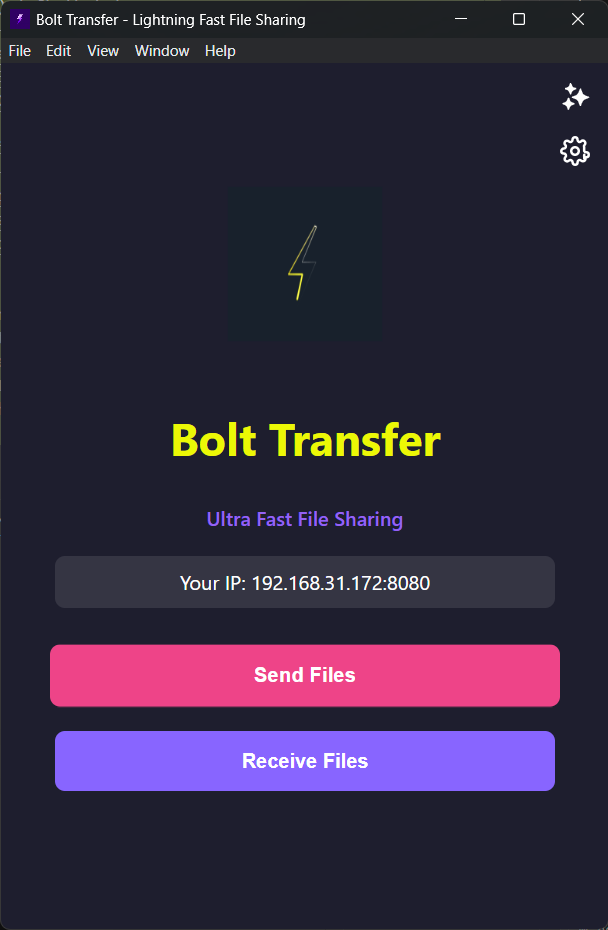
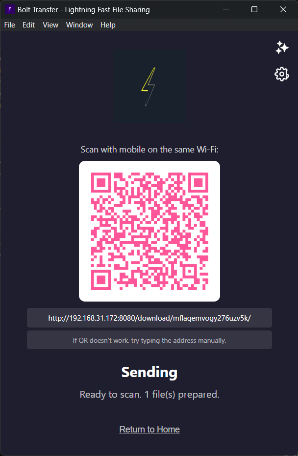

<div align="center">
   <h1>Bolt Transfer ⚡</h1>
   <p><strong>Lightning‑fast, private, local file sharing between Windows and Android/iOS – with an integrated AI log assistant.</strong></p>
   <p>
      <em>Share files over your local network (no cloud, no size limits imposed by a remote server). Ask the built‑in chatbot what you sent or received today, this week, or any other log question.</em>
   </p>
</div>

---

## ✨ Key Features

- 🚀 Fast peer style transfer over your local Wi‑Fi / hotspot (HTTP + QR workflow)
- 🌐 No mobile app required – just scan the QR and use the phone's browser (Android/iOS)
- 📱 Mobile friendly download page (auto‑download on mobile)
- 🔄 Send & Receive modes (multi-file supported)
- 📟 QR code generation for quick phone pairing
- 🖥️ Device connection notifications
- 📊 Real‑time progress updates (renderer via Socket.io)
- 🧠 AI Chatbot (Google Gemini) that can answer questions like:
   - `What files did I send today?`
   - `How many files did I receive this week?`
   - `List all MP4 files I transferred.`
- 🗂️ Transfer history stored as JSON Lines (`transfer_log.jsonl`)
- 🔐 Local only – logs & API key stored on your machine (Electron userData dir)
- 🧹 Clear / Set Gemini API key via Settings window

---

## 🧠 AI Assistant Details
The chatbot window uses Google Gemini (`gemini-1.5-flash`). It builds a prompt from your `transfer_log.jsonl` content and your question. It ONLY has access to what the app logged (no external file scanning). If there are no logs yet, it will tell you there is no history.

You control the API key:
- Stored securely via `electron-store`
- You can remove it using the Clear button in Settings
- No key = chatbot asks you to configure one

---

## 🗃️ Transfer Logging
Each line in `transfer_log.jsonl` is a JSON object like:
```json
{
   "timestamp": "2025-09-15T08:22:11.123Z",
   "type": "send",             // or "receive"
   "filename": "example.pdf",
   "size": 1048576,
   "status": "completed",
   "deviceIp": "192.168.1.42"
}
```
Send entries are written the first time the receiver actually downloads the file (not just when you prepare it), and receive entries are written immediately upon successful upload.

The log file lives in the Electron user data directory, e.g. on Windows:
```
C:\\Users\\<You>\\AppData\\Roaming\\Bolt Transfer\\transfer_log.jsonl
```

---

## 🛠 Tech Stack

| Layer | Tech |
|-------|------|
| Desktop Runtime | Electron |
| Backend (in main process) | Express.js + Node.js core modules |
| Realtime Events | Socket.io |
| File Uploads | Multer |
| QR Code Generation | qrcode (npm) |
| Local Config Storage | electron-store (ESM via dynamic import) |
| AI | @google/generative-ai (Gemini) |
| UI | Plain HTML + CSS + minimal JS |

---

## 📦 Installation (Development Mode)

Prerequisites:
- Node.js (v16+ recommended)
- npm (bundled with Node)

Clone & install:
```bash
git clone <your-repo-url>.git
cd Tranfer  # or renamed folder
npm install
```

Run the app:
```bash
npm start
```

### Optional: Build Windows Installer (.exe)
```bash
npm run build
```
The installer will be generated in the configured `build output` directory (e.g. `appFinal/` or the current setting in `package.json`).

---

## 🚀 Using Bolt Transfer

### Sending Files
1. Launch the desktop app
2. Click “Send Files” and choose one or more files
3. A QR code + session link appears
4. Scan with your phone's camera (or QR app) – it opens directly in the mobile browser (no separate app install needed)
5. Mobile page lists files & auto-downloads (on supported devices)
6. A log entry is created once each file is actually downloaded

### Receiving Files (Desktop Accepting Uploads)
1. Click “Receive Files”
2. A QR code / URL is shown for the upload page
3. Open that page on a phone or another device
4. Select file & upload – desktop saves it into your Downloads/Tranfer directory
5. A receive log entry is recorded immediately

### Chatbot
1. Click the AI icon (top-right) to open chatbot window
2. Ask questions like: `What have I received today?`
3. If no API key is set, open Settings (gear icon) and add your Gemini key
4. Clear key anytime via Settings

---

## 🔐 Privacy Notes
- No data leaves your local network except calls you explicitly make to Gemini
- Transfer log stays local; delete it by removing `transfer_log.jsonl` in the user data directory
- API key is stored locally via `electron-store` (you can clear it)

---

## 📁 Project Structure (Key Files)
```
main.js           # Electron main process + server + AI IPC
index.html        # Main UI
receive.html      # Receive mode UI
mobile-upload.html# Upload page served to phones for sending to desktop
chatbot.(html|js|css)  # Chatbot window
settings.(html|js|css) # Settings window (API key management)
assets/           # Icons, branding, QR/logo assets
transfer_log.jsonl# (Generated) history log (JSON Lines)
```

---

## 🖼 Screenshots 

| Main Window | Send Flow (QR) | Chatbot |
|-------------|----------------|---------|
|  |  |  |

| Mobile Download Page | Receive Mode | Settings (API Key) |
|----------------------|-------------|--------------------|
|  |  |  |


## 📄 License
MIT

---

## 🙌 Contributing
PRs and suggestions welcome. Open an issue for discussion first if adding major features.

Enjoy fast local sharing with intelligence built in. ⚡
